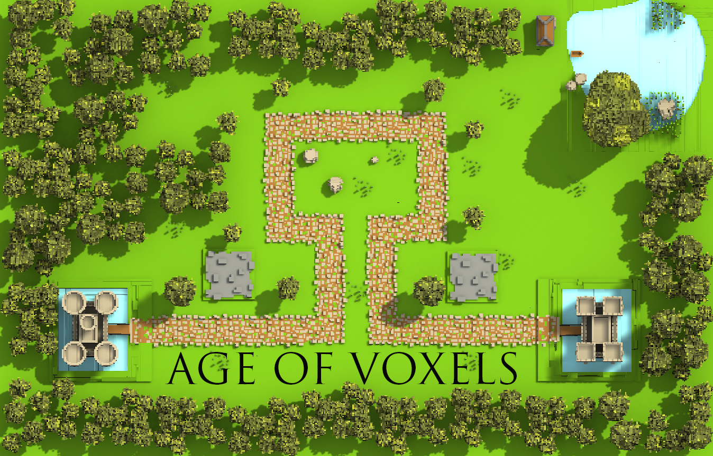 

# Age of Voxels
Воксельная tower-defense PvP игра на Android.

## Геймплей

### Строй
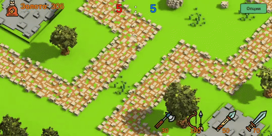

### Сражайся
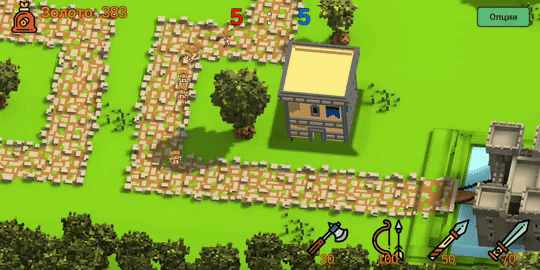


## Игровые объекты

### Воины и их анимации
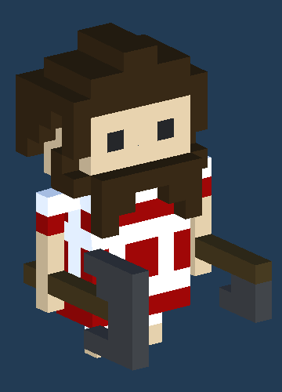
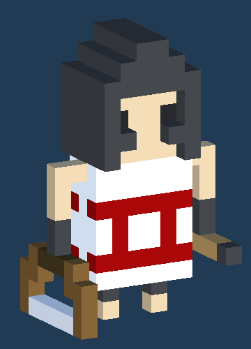
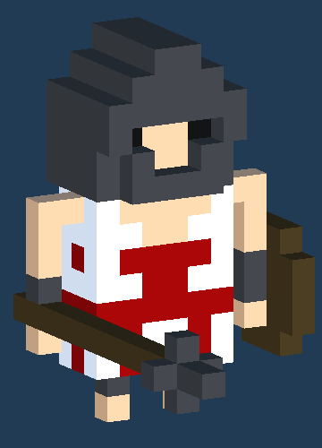
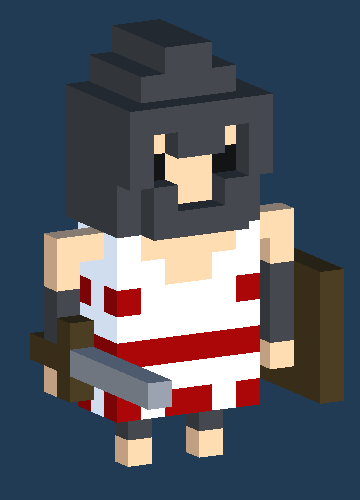

### Здания
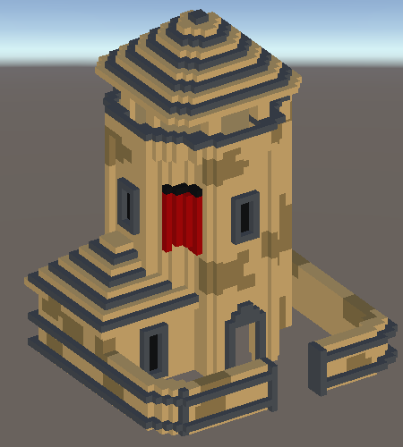
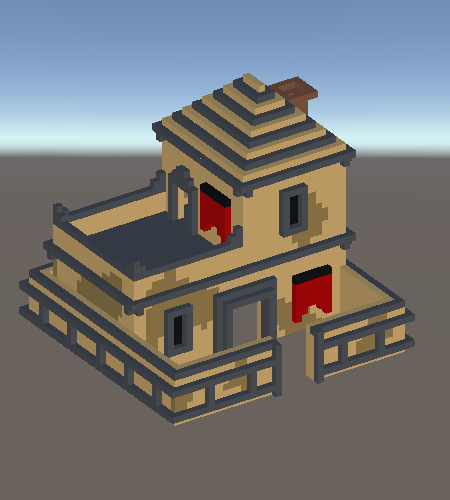
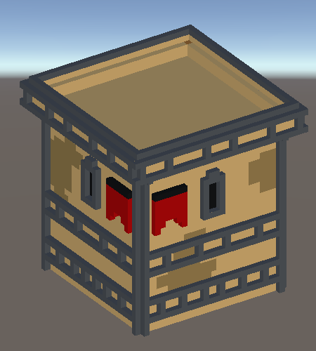

### Замки игроков
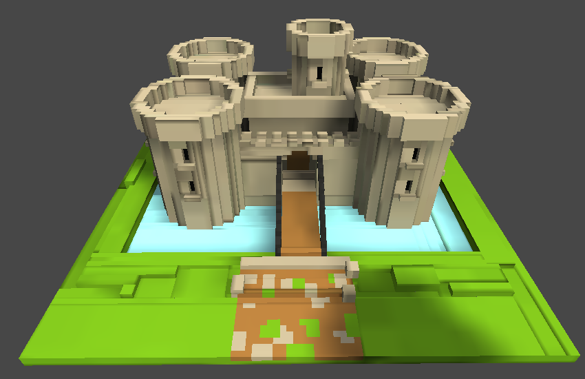
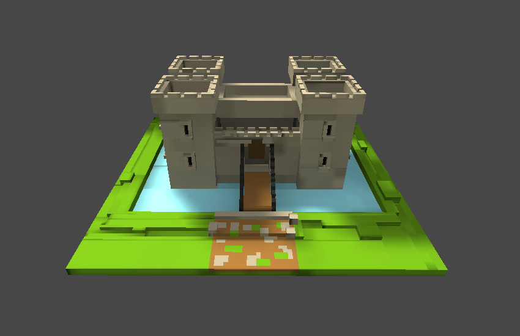


## Фрагменты кода

### Спавн юнитов по выбору
```csharp
public class TreesSpawn : MonoBehaviour
{
    switch (m.GetString(0))
    {
        case "antiqueLumberjackButton":
            Instantiate(lumberjackRed, spawnPointRed, new Quaternion(0, 0, 0, 0));
            break;
        case "antiqueArcherButton":
            Instantiate(archerRed, spawnPointRed, new Quaternion(0, 0, 0, 0));
            break;
        case "antiqueSpearmanButton":
            Instantiate(spearmanRed, spawnPointRed, new Quaternion(0, 0, 0, 0));
            break;
        case "antiqueSwordsmanButton":
            Instantiate(swordsmanRed, spawnPointRed, new Quaternion(0, 0, 0, 0));
            break;
    }
} 
```

### Поиск врага в зоне видимости
```csharp
    if (Vector3.Distance(transform.position, _gameObject.transform.position) < seeDistance)
    {
        if (Vector3.Distance(transform.position, _gameObject.transform.position) > attackDistance)
        {
            transform.LookAt(_gameObject.transform);
            transform.Translate(new Vector3(0, 0, speed * Time.deltaTime));
            _anim.SetBool("Walk", true);
        }
        else
        {
            //таймер для атаки
            if (AttackTimer > 0)
                AttackTimer -= Time.deltaTime;

            if (AttackTimer < 0)
                AttackTimer = 0;
            
            if (AttackTimer == 0)
            {
                Attack();
            }
        }
    }
```

### Нанесение урона
```csharp
    private void DealDamage(object[] _data)
    {
        if (health > 0)
        {
            health -= (int)_data[1];
        }
        else
        {
            //Destroy(gameObject);
            this.gameObject.GetComponent<NavMeshAgent>().enabled = false;
            _anim.Play("Death");
             Destroy (gameObject, this.gameObject.GetComponent<Animator>().GetCurrentAnimatorStateInfo(0).length);
            if (base.player.UserColor == "red")
            {
                if ((string)data[0] == "redUnit")
                {
                    goldConroller.KillTrophy(UnitName);
                }
            }
            else
            {
                if ((string)data[0] == "blueUnit")
                {
                    goldConroller.KillTrophy(UnitName);
                }
            }

        }
    }
```

